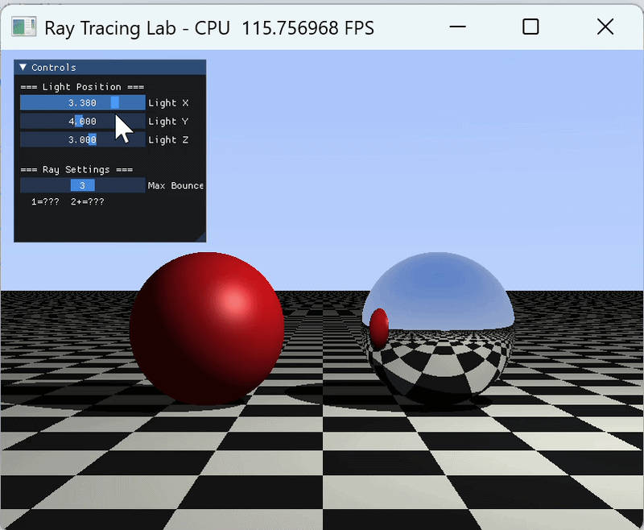
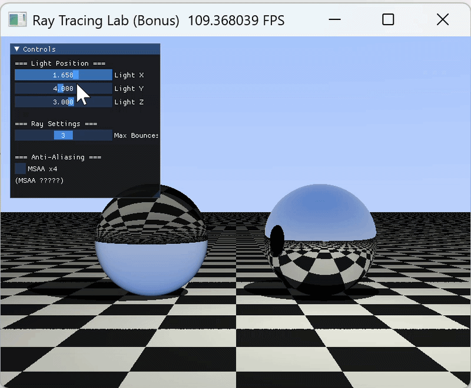

# Whitted-Style 光线追踪实验报告

## 实验概述

本实验基于经典的 **Whitted-Style 光线追踪**模型，使用 [Taichi](https://www.taichi-lang.org/) 框架实现了一个支持实时交互的光线追踪渲染器。通过发射次级射线（Secondary Rays），实现了硬阴影、理想镜面反射，以及选做的玻璃折射与抗锯齿效果。

***

## 实验目标

- **理论理解**：理解光线投射（Ray Casting）与光线追踪（Ray Tracing）的本质区别
- **全局光照**：掌握通过次级射线实现硬阴影和理想镜面反射的方法
- **GPU 编程思维**：将传统递归光线追踪算法改写为适合 GPU 并行计算的迭代（循环）模式

***

## 文件结构

```
.
├── ray_tracing.py          # 主实验：CPU 后端，完成全部必做任务
├── ray_tracing_bonus.py    # 选做扩展：GPU 后端，新增玻璃折射 + MSAA 抗锯齿
├── demo1.gif
├── demo2.gif
└── README.md
```

***

## 环境依赖

```bash
pip install taichi numpy
```

- Python ≥ 3.8
- `ray_tracing.py` 使用 `ti.cpu` 后端，**无需显卡**，兼容所有设备
- `ray_tracing_bonus.py` 使用 `ti.gpu` 后端，需要支持 Vulkan 或 CUDA 的 GPU

***

## 运行方式

```bash
# 必做版本（CPU）
python ray_tracing.py

# 选做扩展版本（GPU）
python ray_tracing_bonus.py
```

***

## 实验原理

### 光线追踪核心流程

每条主光线（Primary Ray）从摄像机出发，击中场景后根据材质分支处理：

1. **阴影测试**：从交点向光源方向发射暗影射线（Shadow Ray）。若射线在到达光源前被遮挡，该点仅保留环境光。
2. **材质分支**：
   - **漫反射（Diffuse）**：使用 Phong 模型计算颜色，终止光线传播。
   - **理想镜面（Mirror）**：按反射定律计算反射方向，生成次级射线继续传播。
   - **玻璃（Glass，选做）**：按斯涅尔定律计算折射方向，并处理全内反射。

### 反射向量公式

$$
\mathbf{R} = \mathbf{L}_{in} - 2(\mathbf{L}_{in} \cdot \mathbf{N})\mathbf{N}
$$

其中 $\mathbf{L}\_{in}$ 为入射方向，$\mathbf{N}$ 为表面法向量。

### 迭代替代递归

GPU 不支持递归调用，本实验将光线弹射改写为 `for` 循环。使用 `throughput`（光线吞吐量）追踪能量衰减，用 `done` 标志替代 `break`：

```python
throughput = 1.0
final_col  = vec3(0.0)
done       = False

for bounce in range(MAX_B):         # 上界必须为编译期常量
    if not done and bounce < max_b: # 运行时动态限制弹射次数
        # ... 求交、着色、更新方向
```

### Shadow Acne 修复

反射射线与暗影射线的起点必须沿法线方向偏移极小量 $\epsilon$，防止射线与自身表面立刻相交产生噪点：

$$\mathbf{P}\_{new} = \mathbf{P} + \mathbf{N} \times \epsilon \quad (\epsilon = 10^{-4})$$

***

## 必做任务实现（`ray_tracing.py`）

### 任务 1：三维场景搭建

场景中包含三种隐式定义的几何体，通过材质 ID 系统区分：

| 材质 ID | 物体           | 位置                        | 材质   |
| ----- | ------------ | ------------------------- | ---- |
| `0`   | 无限大地面（棋盘格纹理） | `y = -1.0`                | 漫反射  |
| `1`   | 红色漫反射球       | `(-1.5, 0.0, 0.0)`，半径 1.0 | 漫反射  |
| `2`   | 银色镜面球        | `(1.5, 0.0, 0.0)`，半径 1.0  | 理想镜面 |

棋盘格纹理通过交点 `x`、`z` 坐标的奇偶性（XOR）判断：

```python
cx = int(ti.floor(p.x)) & 1
cz = int(ti.floor(p.z)) & 1
base_col = white if (cx ^ cz) == 0 else black
```

### 任务 2：迭代式光线弹射

- 每次击中镜面材质，更新射线方向，`throughput *= 0.8`（反射率 80%），继续循环
- 击中漫反射材质，计算 Phong 着色，`throughput` 乘以颜色后写入 `final_col`，设 `done = True`
- 未击中任何物体（天空），基于射线 `y` 分量插值蓝白渐变天空色

### 任务 3：硬阴影与 Shadow Acne 修复

`in_shadow()` 函数从着色点出发向光源发射暗影射线，仅检测到达光源距离范围内的遮挡。起点沿法线偏移 `EPS = 1e-4`。

### 任务 4：UI 交互面板

使用 `ti.ui.Window` 实现实时交互控件：

| 控件              | 范围           | 说明         |
| --------------- | ------------ | ---------- |
| Light X / Y / Z | 可调范围见面板      | 动态改变点光源位置  |
| Max Bounces     | 1 \~ 5（默认 3） | 控制光线最大弹射次数 |

> 将 Max Bounces 设为 1 可对比无反射与有反射效果的差异。

### 效果展示



从渲染结果可以观察到以下几点：

**镜面反射的多次弹射**：右侧银球表面清晰映出了左侧红球的倒影，以及棋盘格地面向远处延伸的透视畸变。这是光线在镜面球与地面之间完成至少两次弹射的结果——若将 Max Bounces 调为 1，银球将只反映天空颜色，倒影消失。

**硬阴影的锐利轮廓**：两球在地面投下了边缘清晰的阴影，这是点光源配合暗影射线检测的典型特征。点光源没有面积，因此没有半影过渡区，阴影内外亮度形成突变。拖动光源滑块可以实时看到阴影随光源移动同步跟随，验证了暗影射线每帧实时计算的正确性。

**Phong 高光**：红球顶部的高光亮斑偏向光源方向，形状较紧（高光指数 32），符合 Blinn-Phong 模型的预期表现。

**棋盘格透视收缩**：地面格子在远处明显变密，正确呈现了透视投影的近大远小效果，说明交点的奇偶判断与相机空间映射均实现正确。

***

## 选做扩展（`ray_tracing_bonus.py`）

### 选做 ①：折射与玻璃材质（+15%）

将左球改为玻璃材质（折射率 IOR = 1.5），引入斯涅尔定律计算透射光线方向：

**折射方向（斯涅尔定律）：**

$$\sin\theta\_t = \frac{\eta\_i}{\eta\_t}\sin\theta\_i$$

- 当 $\sin^2\theta\_t > 1$ 时发生**全内反射**（Total Internal Reflection），光线按反射方向传播
- 使用 **Schlick 近似**计算菲涅尔系数，决定反射/折射能量分配：

$$R(\theta) = R\_0 + (1 - R\_0)(1 - \cos\theta)^5, \quad R\_0 = \left(\frac{1 - \text{IOR}}{1 + \text{IOR}}\right)^2$$

实现中通过 `rd.dot(hit_n) > 0` 判断光线是否从内部射出，自动切换折射率比值（$\eta$ 与 $1/\eta$）。

### 选做 ②：MSAA 抗锯齿（+10%）

每个像素内随机采样多次（默认 `MSAA_SAMPLES = 4`），对颜色取平均，消除物体边缘锯齿：

```python
for s in range(MSAA_SAMPLES):
    jx = rand_float(seed_x) - 0.5   # [-0.5, 0.5] 的亚像素抖动
    jy = rand_float(seed_y) - 0.5
    # 计算带抖动的射线方向 ...
    accum += trace_ray(...)

pixels[px, py] = accum / float(n_samples)
```

随机数通过简单 Hash 函数（基于像素坐标和采样序号）生成，避免引入额外状态。MSAA 可通过 UI 面板的 `MSAA x4` 复选框实时开关。

### 效果展示



与必做版相比，选做版的渲染结果有以下明显变化：

**玻璃球的透射与全内反射共存**：左侧玻璃球的上半部分以折射为主，可以透过球体看到球后方场景的扭曲像——这是光线穿透球体、在弯折后再次射出时携带的背景信息。而球体下边缘区域，由于入射角超过临界角发生全内反射，呈现出类似镜面的高反射效果，与上方的透明区域形成鲜明对比，正确还原了真实玻璃球的外观。

**菲涅尔效应的视觉体现**：球体正面（入射角小）透射比例高，边缘（入射角大）反射比例逐渐增大。Schlick 近似使这一过渡连续且自然，避免了硬切换的不真实感。

**MSAA 对边缘质量的提升**：相比必做版，球体轮廓处的锯齿明显减少，地面棋盘格与球体交界处的过渡也更平滑。开启 MSAA x4 后每帧计算量增加约 4 倍，但由于使用 GPU 后端，帧率仍保持在可交互水平，体现了 GPU 并行计算在这类密集采样场景下的优势。

***

## 核心实现摘要

### 球体求交（解析法）

射线参数方程代入球面方程，得一元二次方程 $at^2 + bt + c = 0$：

```python
disc = b*b - 4*a*c
t = (-b - sqrt(disc)) / (2*a)  # 优先取近端交点
```

### Phong 光照模型

$$\text{Color} = k\_a \cdot I\_a + k\_d \cdot (N \cdot L) \cdot I\_d + k\_s \cdot (N \cdot H)^{n} \cdot I\_s$$

其中 $H$ 为半程向量（Blinn-Phong 变体），高光指数 $n = 32$。

***

## 参数配置参考

| 参数             | 必做版          | 选做版          |
| -------------- | ------------ | ------------ |
| 分辨率            | 800 × 600    | 800 × 600    |
| 后端             | `ti.cpu`     | `ti.gpu`     |
| 最大弹射次数         | 1 \~ 5（默认 3） | 1 \~ 5（默认 3） |
| MSAA 采样数       | —            | 4（可关闭）       |
| 折射率（IOR）       | —            | 1.5          |
| Shadow Acne 偏移 | `1e-4`       | `1e-4`       |

